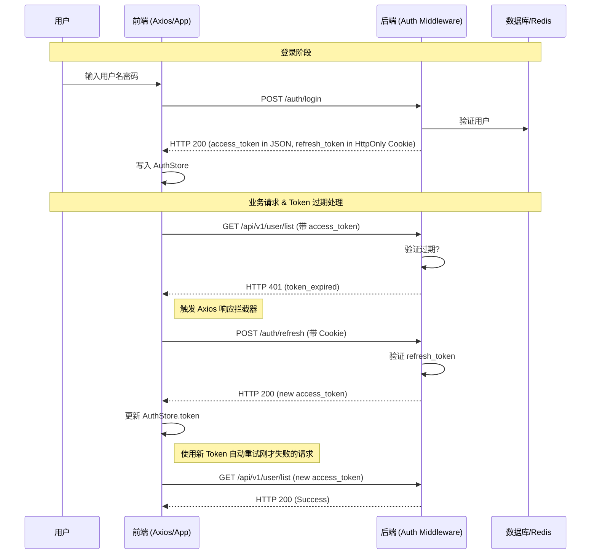
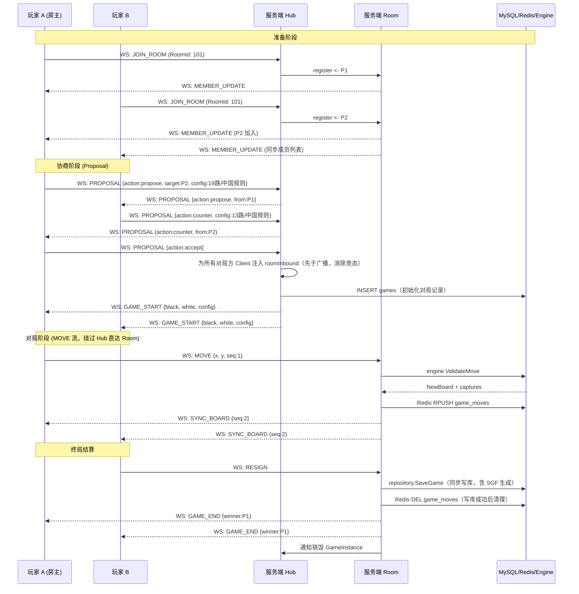
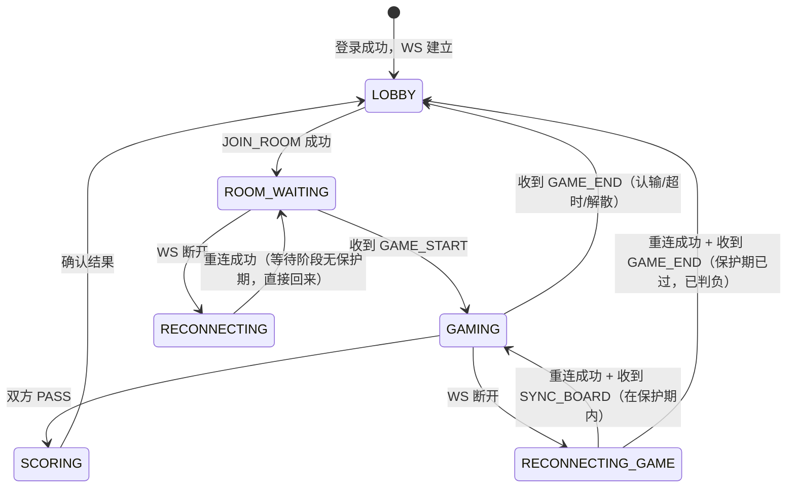
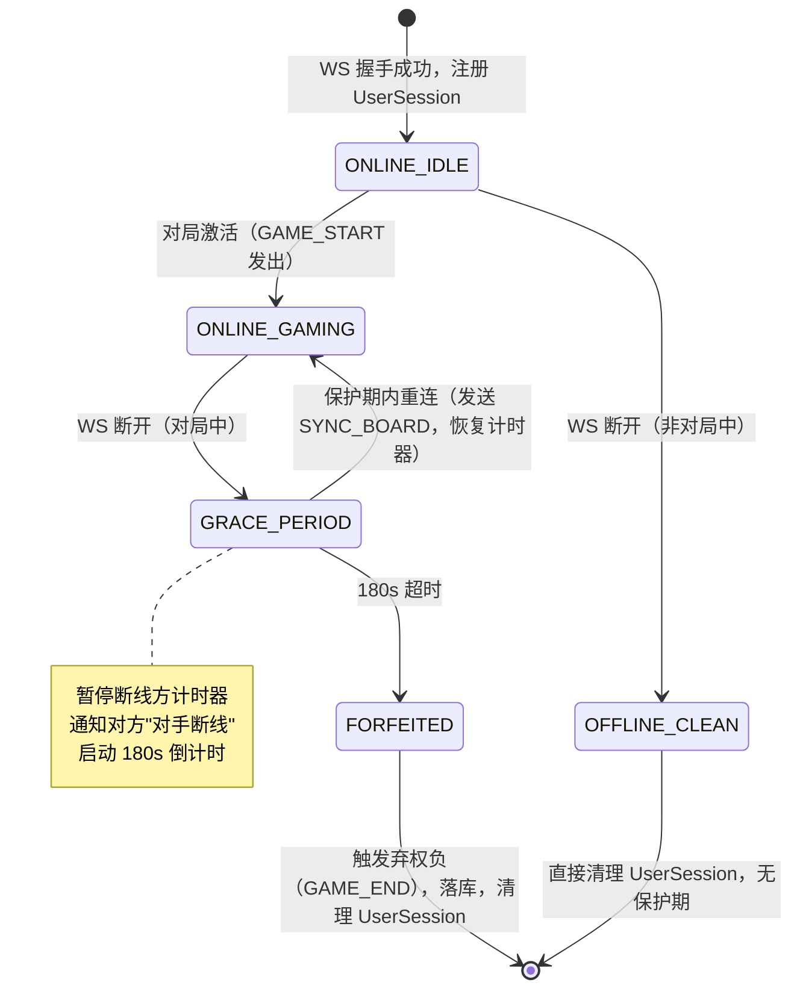
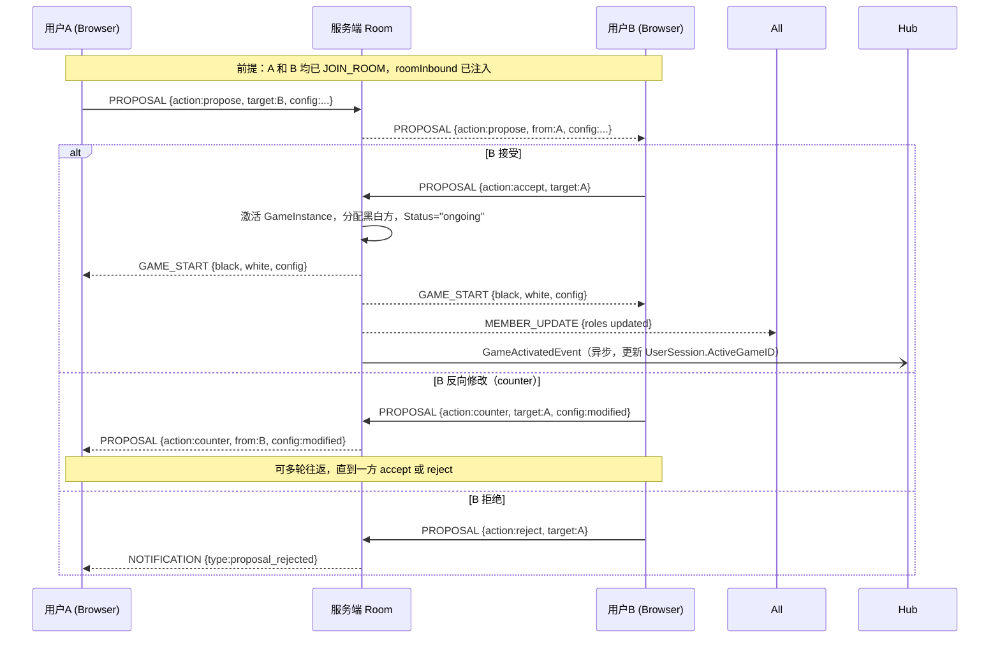
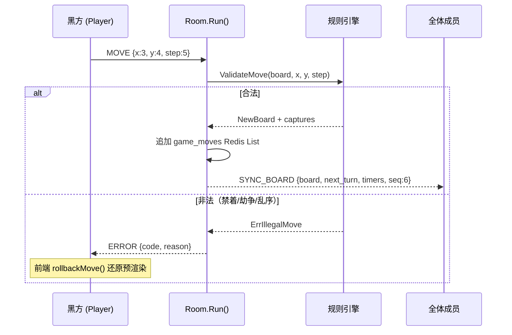
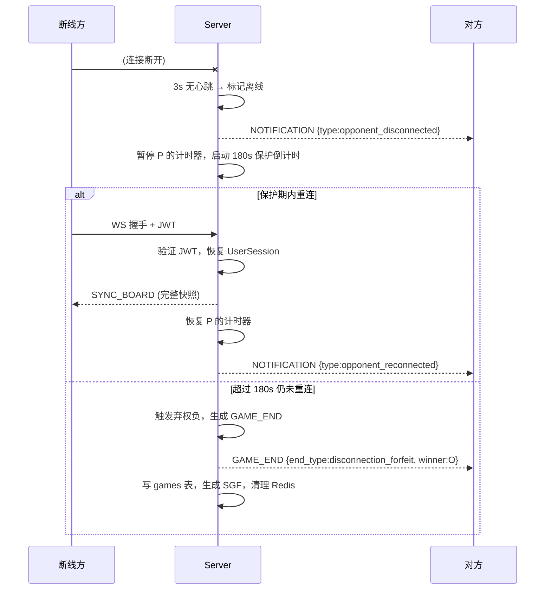

# 架构时序图与流程图 (Diagrams)

> **路径**：[`docs/design/diagrams.md`](diagrams.md)  
> **用途**：项目核心业务流程的可视化呈现，包括前后端交互、分层调用和关键状态机转换。  
> **关联文档**：[技术设计总纲](./tech-design.md) · [前端设计](./frontend-design.md) · [WS 架构](./ws-design.md)

---

## 1. 认证流：登录与 Token 自动刷新

为了保证用户体验，我们采用 `access_token` (短期) + `refresh_token` (长期) 的双 Token 方案。前端 Axios 拦截器须实现无感刷新。

---

## 2. 对局全生命周期

从大厅进入房间，到对局结束并记录 SGF 的全套逻辑。

---

## 3. 连接与对局状态机

### 3.1 客户端状态机（前端视角）

描述用户在浏览器内的页面/连接状态流转。

---

### 3.2 服务端状态机（UserSession / 断线保护视角）

描述服务端对单个用户会话生命周期的管理。

---

## 4. 对局协商流程（PROPOSAL 多轮）

---

## 5. 落子流程（MOVE → 规则引擎 → 广播）

---

## 6. 断线保护与恢复

