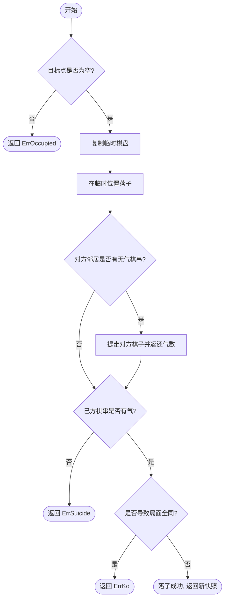
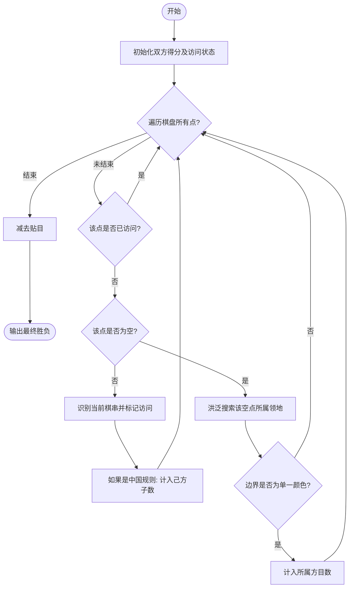

# 规则引擎设计文档

> **路径**：[`docs/design/rule-engine.md`](rule-engine.md)  
> **用途**：围棋规则介绍（逻辑规则、中国规则、日本规则对比）及 Go 语言规则引擎实现设计。  
> **参考**：
> - [知乎文章《围棋逻辑规则及中国规则简介》 - 南极捕鱼的潘达](https://zhuanlan.zhihu.com/p/32295016)；
> - [C++ 原版实现](https://github.com/Misaka13906/Game-of-Go)  
>
> **关联文档**：[技术设计总纲](./tech-design.md) · [数据存储设计](./data-schema.md)

---

## 1. 围棋规则体系概述

### 1.1 逻辑规则（Tromp-Taylor Rules）

逻辑规则是围棋规则的一种数学化描述，由 John Tromp 和 Bill Taylor 提出，自 1996 年起被大部分围棋 AI（包括 AlphaGo）采用。知乎原文对逻辑规则的逐条原文及诠释如下：

---

**原文第 1 条**：围棋由两位名为"黑"与"白"的玩家，在 19 乘 19 的正方形格点上进行。

> 格点即棋盘上的交叉点，围棋盘也可以有其它规格，比如 13 路、9 路。

**原文第 2 条**：每个格点可以被染色为黑、白或无色。

> 将格点染成黑（白）色等价于落黑（白）子；将格点染为无色等价于提走棋子。

**原文第 3 条**：给定格点 P，如果没有被染色为 C，且存在一条（水平或垂直）起始于 P 点、由相连的 P 的同色点组成、终止于某 C 色点的路径，那么我们说点 P 能到达 C 色。

> **一串棋子（string）** 即同色相连棋子的集合（注意区别于"一块 group"）。一串棋子能到达多少个无色点，它就有多少口**气（liberty）**。

**原文第 4 条**：清除一种颜色是指清空一切那种颜色、且不能到达无色的点。

> 等价于：将一串没有气的棋子提走。

**原文第 5 条**：从全盘无色的格点开始，两位玩家轮流操作，由"黑"玩家先行。

> 空枰开局，黑先白后。

**原文第 6 条**：每个回合，玩家只能从以下两种操作中选择其一：a) 弃权；b）行动，且此行动的结果不得重复已有的格点染色。

> 定义了两个概念：
> 1. 允许**弃权（Pass）**
> 2. **禁循环（禁全同，PSK规则）**：禁止使对手面对任何已出现过的局面。这与新西兰规则中的 SSK（超级禁循环）有微妙区别。

**原文第 7 条**：一次行动由以下步骤组成：a) 将一个无色点染成己方的颜色；b) 然后清除对方的颜色；c）清除己方的颜色。

> 规定了落子后的处理顺序：**先提对方无气棋串，再提己方无气棋串**。c 款意味着**允许自杀（块子自尽）**，与应氏规则一致，不同于中国规则。

**原文第 8 条**：游戏在两次连续的弃权后结束。

> 两弃终局。

**原文第 9 条**：黑（白）方的总分，是黑（白）色格点颜色的总数，与仅与黑（白）色相连的无色点的总数之和。

> **子空皆地（Area Scoring）**：己方活子数 + 己方包围的空点数 = 己方总分。得分高者为胜，平分则平局（一般给白方加非整数贴目以避免平局）。

---

### 1.2 三种规则核心差异

#### 计分方式

| | 中国规则 | 日本规则 | 逻辑规则 |
|:---|:---|:---|:---|
| **计分原则** | **子空皆地**：活子 + 围住的空点 | **唯空是地**：仅围住的空点 + 提子数 | **子空皆地**（同中国规则）|
| **贴目** | 7.5 目（白贴） | 6.5 目（白贴） | 无固定规定 |
| **补单官** | 不损目（因为收回自己地盘的空点也算己方的地） | **损目**（在己方空内落子会减少一目） | 不损目 |

日本规则"补单官损目"导致的问题：吴清源-高川格对局中，白棋因补棋会亏一目而拒绝补棋，引发争议（详见文章所述 1959 年事件）。中国规则下，补单官不损目，此类争议不会发生。

#### 自杀禁止

| | 中国规则 | 日本规则 | 逻辑规则/应氏规则 |
|:---|:---|:---|:---|
| **自杀（落子后己方棋串无气）** | **禁止** | 禁止 | **允许**（逻辑规则第 7 条 c 款）|

#### 终局争议处理

| | 中国规则 | 日本规则 |
|:---|:---|:---|
| **死活争议** | **实战解决**：重新对局，由认为是死棋的一方先下 | 规约钦定（如"盘角曲四净死"）|
| **优势** | 逻辑一致，无例外情况 | 争议可能无法自洽（如盘角曲四有劫材时）|

文章结论：**"实战解决"精神使得中国规则在逻辑上明显优于日本规则**。逻辑规则除允许块子自尽外，与中国规则基本等效。

---

### 1.3 本项目选择

根据 C++ 原版实现和中国规则语义，本项目采用：

| 规则项 | 选择 | 原因 |
|:---|:---|:---|
| 计分方式 | **子空皆地（中国规则）** | 逻辑简单，无补单官损目问题，便于服务端计算 |
| 自杀禁止 | **禁止自杀** | 同中国规则；C++ 原版 `isLegal = false`（注释中 Tromp-Taylor 规则是允许的但被屏蔽） |
| 打劫检测 | **简单劫（Simple Ko）** | 与落子前两步棋盘状态对比，不实现完整 PSK，能覆盖绝大多数实战情况 |
| 贴目 | **7.5 目（中国规则）** 或 **6.5 目（日本规则）** | 由对局配置 `config_snap.komi` 决定，引擎层不硬编码 |
| 死子结算 | **人工标记 + 实战解决** | 玩家点击标记死子，有争议则继续实战 |

---

## 2. 数据结构设计

### 2.1 棋盘表示

```go
type Color int8

const (
    Empty Color = 0
    Black Color = 1
    White Color = 2
)

const MaxSize = 19

// Board 表示棋盘状态，[row][col]，row 和 col 从 0 开始
type Board [MaxSize][MaxSize]Color
```

### 2.2 并查集（Union-Find）管理棋串

**设计说明**：

C++ 原版用每颗棋子的 Move 结构体维护并查集，`root` 存祖先 id，`liberty` 只在根节点上维护。Go 版本将并查集独立封装，避免与游戏状态耦合。

```go
// StringSet 用于管理棋盘上的棋串，使用并查集
// 节点编号 = row * size + col
type StringSet struct {
    parent  [MaxSize * MaxSize]int
    liberty [MaxSize * MaxSize]int  // 只在根节点有意义
    size    int                     // 棋盘路数
}

func (s *StringSet) Init(boardSize int) {
    s.size = boardSize
    for i := range s.parent {
        s.parent[i] = i
        s.liberty[i] = 0
    }
}

func (s *StringSet) Find(id int) int {
    if s.parent[id] != id {
        s.parent[id] = s.Find(s.parent[id]) // 路径压缩
    }
    return s.parent[id]
}

func (s *StringSet) Union(a, b int) {
    ra, rb := s.Find(a), s.Find(b)
    if ra != rb {
        s.parent[ra] = rb
    }
}
```

### 2.3 对局快照（GameSnapshot）

```go
// GameSnapshot 是一次落子后的完整棋盘快照，用于打劫检测和断线恢复
type GameSnapshot struct {
    Board    Board
    NextTurn Color
    Step     int    // 当前手数（单调递增，用于乱序检测）
    BlackCap int    // 黑方已提子数（累计）
    WhiteCap int    // 白方已提子数（累计）
}
```

---

## 3. 核心算法

### 3.1 落子流程（PlaceStone）

对应 C++ `placePiece()` 函数，整体流程：

`PlaceStone(board, x, y, color, prevBoard) → (newSnapshot, captures, error)`

步骤：
1. 合法性前置检查：目标点是否为空
2. 复制当前棋盘状态到临时状态（不污染原状态）
3. 在临时状态落子，初始化并查集节点
4. 遍历四邻：
   - 相同颜色：Union 合并棋串
   - 不同颜色：更新对方棋串气数
5. 计算所有受影响棋串的气数（countLiberty）
6. 清除对方气数为 0 的棋串（提子），更新提子计数
7. 检查己方落子后是否气数为 0：
   - 若气数 = 0 → 禁入，返回 ErrSuicide
8. 打劫检测：与 prevBoard 对比，若状态相同 → 返回 ErrKo
9. 提交临时状态，返回新 Snapshot

#### 流程图 (PlaceStone Logic)


```

```go
var (
    ErrOccupied = errors.New("intersection is not empty")
    ErrSuicide  = errors.New("suicidal move is not allowed")
    ErrKo       = errors.New("ko: position already existed")
    ErrOutOfBound = errors.New("position out of bounds")
)

func PlaceStone(
    curr GameSnapshot,
    x, y int,
    color Color,
    prev *GameSnapshot, // 上一手状态，用于简单劫检测；nil 表示第一手
) (GameSnapshot, error)
```

### 3.2 气数计算（CountLiberty）

对应 C++ `countLiberty()` 深度优先搜索：

```
CountLiberty(board, x, y, color) → int

算法：
- BFS/DFS 洪泛：从 (x,y) 开始，访问所有同色相连格点
- 对每个相连格点，检查四邻：
  - 若邻格为空（Empty）且未计数：liberty++，标记已计数
  - 若邻格为同色：加入队列继续搜索
  - 若邻格为异色：跳过
- 使用 visited bitset 防止重复访问
```

**注意**：C++ 原版用两个 bitset（`vis` 和 `counted`）分别追踪"已访问的格点"和"已计入气数的空点"，避免重复计数同一个气。Go 实现保留这个设计。

### 3.3 提子（RemoveString）

对应 C++ `clear()` 函数，DFS 提走同色相连无气棋串：

```go
// RemoveString 从 (x, y) 出发，DFS 清除同色相连的所有棋子
// 同时返还被清除棋子周围异色棋串的气数
func RemoveString(board *Board, ss *StringSet, x, y int, size int) (captured int)
```

**关键**：清除棋子时，需同步更新相邻异色棋串的气数（对应 C++ `clear()` 中 `m[an].liberty++`）。

### 3.4 打劫检测（Ko Detection）

C++ 实现：`isSame((now-1)->board)` 与落子前两步的棋盘比对。

Go 实现维持相同语义：**简单劫（Simple Ko）**，仅与上一手状态比较：

```go
func isSameBoard(a, b *Board) bool {
    return *a == *b  // Board 是值类型数组，可以直接比较
}
```

### 3.5 性能复杂度基准 (Complexity Limits)
为保证在单核下能支撑上千盘对弈同时进行，引擎核心算法必须符合以下 Big-O 限制：
- **存子/状态更新**: `O(1)` (基于 `Board[19][19]` 数组寻址)。
- **棋串合并 (Union-Find)**: `O(α(N))`，接近 `O(1)`。
- **气数计算/提子 (DFS/BFS)**: 最坏情况 `O(N)`，其中 N 为全盘交叉点 361。
- **快照内存 (Space)**: 一局 300 手的完整对弈快照在内存中应处于 Kb 级别，不可滥用冗余的指针嵌套。

---

## 4. 计分（Scoring）

对应 C++ `handleResult.cpp`，支持中国规则和日本规则。

### 4.1 算法

`Score(board, komi, rule) → (blackScore, whiteScore, winner)`

1. 遍历所有格点，对每个非空格点启动 DFS（洪泛搜索）
2. DFS 规则：从该格点出发，访问所有同色相连格点 + 被包围的空点
   - 中国规则（Area Scoring）：棋子本身 + 包围的空点都计入总分
   - 日本规则（Territory Scoring）：只计空点，棋子本身不计
3. 日本规则额外加入提子数（deadBlack、deadWhite）
4. 结果：
   - 中国规则：黑分 − 白分 − komi（komi = 7.5）
   - 日本规则：(黑空 + 白提子数) − (白空 + 黑提子数) − komi（komi = 6.5）

#### 流程图 (Scoring Logic)


```

```go
type Rule int8

const (
    RuleChinese  Rule = 0  // CN：子空皆地
    RuleJapanese Rule = 1  // JP：唯空是地
)

type ScoreResult struct {
    BlackScore float64
    WhiteScore float64
    Diff       float64  // 正值 = 黑胜，负值 = 白胜
    Winner     Color
}

func CalculateScore(board Board, deadBlack, deadWhite int, komi float64, rule Rule) ScoreResult
```

### 4.2 中国规则 vs 日本规则计分对比（来自 C++ handleResult.cpp）

```cpp
// 中国规则：子空皆地，不额外加提子数
diff = sumB - sumW - 7.5;  // sumB/sumW 包含己方棋子和己方包围空点

// 日本规则：唯空是地，加上提子数
diff = (sumB + deadW) - (sumW + deadB) - 6.5;  // sumB/sumW 只含空点
```

---

## 5. 死子结算

对应 C++ `markDeadPiece.cpp`，采用**人工标记 + 实战解决**机制：

```
① 双方 Pass 两次后进入死子结算阶段
② 玩家点击棋子 → 服务端 DFS 标记整个相连同色棋串为"死子"
③ 再次点击取消标记（DFS 取消）
④ 双方确认 → 从棋盘移除所有标记的死子 → 计算最终分数
⑤ 若有争议 → 继续实战，由认为是死子的一方先下
```

```go
// MarkDead 标记/取消标记 (x, y) 所在棋串为死子
// 返回更新后的标记状态和更新的 deadBlack/deadWhite 计数
func MarkDead(board Board, marked [][]bool, x, y int, mark bool) ([][]bool, int, int)

// ConfirmDead 从棋盘移除所有已标记为死子的棋子，返回最终棋盘
func ConfirmDead(board Board, marked [][]bool) Board
```

---

## 6. 包结构

```
internal/engine/
  board.go      ← Board 类型、Color 枚举、基础操作（邻格、边界检查）
  string_set.go ← 并查集（StringSet），管理棋串合并和气数
  rule.go       ← PlaceStone、合法性检查（禁入、打劫）、RemoveString、CountLiberty
  score.go      ← CalculateScore（中国/日本规则）
  dead.go       ← MarkDead、ConfirmDead（死子标记流程）

pkg/sgf/        ← 【独立包】供本平台及外部其他开源项目使用
  parser.go     ← Parser 接口约束
  linear.go     ← LinearParser 实现（P1阶段使用，基于简单分割）
  tree.go       ← TreeParser 实现（P2阶段使用，基于 AST 解析）
  builder.go    ← 线性/树状 SGF 生成器配置
```

---

## 7. SGF 序列化与解析策略 (P1 vs P2)

> **参考来源**：
> 1. [SGF File Format FF[4] (red-bean.com)](https://www.red-bean.com/sgf/sgf4.html)
> 2. [Smart Game Format (Sensei's Library)](https://senseis.xmp.net/?SGF)
> 3. [SGF 格式研发速查手册](../reference/sgf.md)

对于 SGF 文件的生成与解析，本着**务实与渐进演进**的原则，采用分离演进的策略。

### 7.1 P1 阶段：线性记谱（极简字符串操作）

对于 P1 阶段，我们的主要诉求是：**存储用户下完的正常对局记录、落子流水，并允许单线回放**。真实的线上实战对局**绝对没有变化图（Variations）**，它是一条完美的单项链表序列。

因此，P1 阶段完全不需要复杂的 AST（抽象语法树）解析器：
- **生成（序列化）**：只需用最简单的 `strings.Join` 将包含坐标的字符数组组装即可。
  ```go
  // 生成示例
  moves := []string{";B[pd]", ";W[dp]", ";B[pq]"}
  sgf := "(;FF[4]GM[1]SZ[19]..." + strings.Join(moves, "") + ")"
  ```
- **解析（反序列化）**：拿到 `.sgf` 文本后，掐掉头部的 `(;` 和尾部的 `)`，然后简单地用 `strings.Split(sgf, ";")` 按照分号切分，再过滤掉头部的元数据 `FF[4]...`，后面整齐划一的全是 `B[xy]` 形式的线性落子流水。

这种做法极其高昂效、零依赖，且能通过所有标准 SGF 阅读器的兼容性测试。

### 7.2 P2 阶段：对局研究与演生树（引入 AST 解析）

当产品演进到 P2 阶段，引入**对局研究、死活题复盘、探讨变化图**时，SGF 中的数据结构将变成一棵真正的树：
```sgf
(;FF[4]... ;B[pd] ;W[dp] (;B[pq] ;W[dd]) (;B[cd] ;W[ed]))
```
- **架构演进**：在 P2 阶段，我们将引入一个真正的词法分析器 (Lexer) 和语法解析器 (Parser)，将原始的 SGF 构建为一棵 `GameTree` 内存对象（包含父节点指针、多个 `Children` 分支指针）。
- 这两个解析器是独立互补的。主链路（实战记录）依然可以使用最高效的线性解析，而研究室/打谱模块则注入复杂的树形解析器。

### 7.3 `pkg/sgf` 接口设计与对外开源能力

为了支持上述的演进，SGF 的解析能力不会写死在 `internal/engine` 里，而是作为一个通用的独立包 `pkg/sgf`。该包设计为完全解耦，**甚至未来可以单独剥离出来，作为一个通用的 Golang SGF 类库供其他开源项目使用**。

其核心采用面向接口编程（Interface-driven）的设计：

```go
package sgf

// 解析产物的公共定义
type Metadata struct {
	Size int
	Komi float64
	Rule string
	// ...
}

// Node 可能是简单的线性切片，也可能是树的指针节点
type Node interface {
    Property(key string) string
}

// ------ 核心接口：解析与格式化 ------

// Parser 负责将 sgf 文本反序列化为对象
type Parser interface {
	Parse(sgf string) (Metadata, []Node, error)
	// 或者在 P2 提供 ParseTree() (GameTree, error)
}

// Formatter 负责将业务对象（单线历史或研究树）序列化为标准的 sgf 文本
type Formatter interface {
    Format(meta Metadata, nodes []Node) (string, error)
}

// ------ 实现一：基于 strings.Split/Join 的极简实现（P1） ------
type LinearCodec struct{}

func (c *LinearCodec) Parse(sgf string) (Metadata, []Node, error) {
	// ... 使用 strings.Split 掐头去尾的高效解析
}

func (c *LinearCodec) Format(meta Metadata, nodes []Node) (string, error) {
    // ... 使用 strings.Join 极速拼装单线 sgf 文本
}

// ------ 实现二：基于 AST Lexer 的完整实现（P2） ------
type TreeCodec struct{}

func (c *TreeCodec) Parse(sgf string) (Metadata, []Node, error) {
	// ... 基于词法状态机的严格解析，支持分支
}

func (c *TreeCodec) Format(meta Metadata, nodes []Node) (string, error) {
	// ... 递归遍历多叉树 GameTree，处理 () 括号嵌套输出
}
```

在后端业务层中，只需按需注入。在最开始的 P1 阶段，我们只需让依赖容器或者业务服务绑定 `&LinearCodec{}`，它既充当 `Parser` 又充当 `Formatter`，即可完美运转。

---

## 8. 关键测试用例

规则引擎测试优先级最高（`go test ./internal/engine/...`）：

| 用例 | 验证点 |
|:---|:---|
| 普通落子 + 提子 | 气数为 0 时正确提走对方棋串 |
| 提子后己方获气 | 提子后相邻己方棋串气数正确更新 |
| 禁入（自杀）检测 | 落子后己方棋串气数为 0 → 返回 ErrSuicide |
| 简单劫 | 落子后棋盘状态与上一手相同 → 返回 ErrKo |
| 多子同时提 | 一次落子提走多个相连棋串 |
| 计分（中国规则）| 子空皆地：活子 + 包围空点，减 7.5 贴目 |
| 计分（日本规则）| 唯空是地：空点 + 提子数，减 6.5 贴目 |
| 死子标记 DFS | 点击一颗子标记整串；再次点击取消 |
