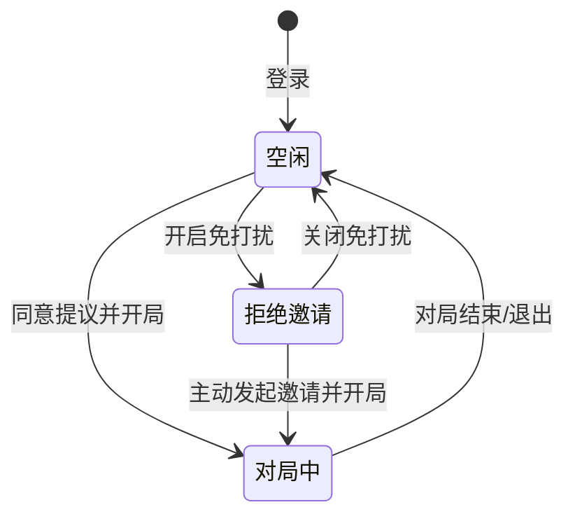
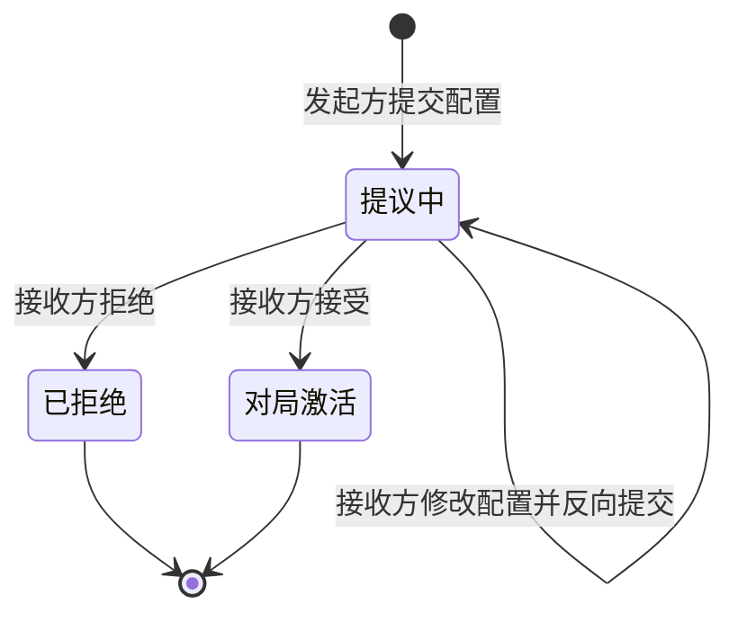

# 业务建模 (Business Model) - 棋幻世界 (Fantasy Go World)

> **路径**：[`docs/requirement/business-model.md`](business-model.md)  
> **用途**：将现实对弈流程抽象为领域模型，定义核心实体、状态机和业务规则，是技术设计的业务依据。

---

## 1. 核心领域实体 (Domain Entities)

### 1.1 用户 (User)
*   **标识**: 唯一身份 ID、昵称。
*   **属性**: 当前段位 (Rank)、等级分 (Elo)、胜平负统计。
*   **偏好**: 拒收邀请开关。
*   **状态**: 全局维度下的活跃状态（空闲、对局中、拒绝邀请）。

### 1.2 房间 (Room)
*   **定义**: 一个临时的逻辑容器，用于承载用户群体进行互动。
*   **成员**: 一个动态的用户集合，字段有引用用户ID+房间内的角色（黑方、白方、观战者）。
*   **房主**: 房间的创建者，引用用户ID。
*   **状态**: 
    *   **等待中 (Waiting)**: 尚未达成对局协议，成员均为观战者。
    *   **对局进行中 (Ongoing)**: 已激活对局实例，新进入者自动成为观战者。
*   **可见性**: 公开（大厅可见）或 私密（仅限邀请）。

### 1.3 对局配置 (Game Configuration)
*   **定义**: 描述特定棋局竞技规则与参数的结构化实体，是开启对局的契约。
*   **内容属性**: 
    *   **棋盘设置**: 棋盘路数（如 19/13/9，支持自定义 N 路。异形配置在 P2 后再考虑迭代支持）、规则标准（中国规则/日本规则）。
    *   **补偿方案**: 贴目分值。
    *   **用时方案**: 计时制度（读秒制/包干制）及具体时长参数。
    *   **初始执子**: 指定黑方、指定白方或由系统随机分配。
*   **作用**: 该实体在“对局提议”过程中流转，一旦达成一致，即成为激活“对局实例”的唯一指令参数。

### 1.4 对局实例 (Game Instance)
*   **定义**: 协商达成一致后激活的、具有生命周期的竞技过程实体。
*   **对局状态**: 进行中、已结束。
*   **竞技数据**: 
    *   **棋盘快照**: 当前所有交叉点的状态。
    *   **指令序列**: 手数、动作类型、坐标、用时、时间戳。
*   **计时容器**: 服务端实时维护两选手的剩余用时和读秒状态。
*   **关联实体**: 引用对局双方的用户 ID（确定黑/白角色）及当前房间的观战用户。

### 1.5 对局记录 (Game Record)
*   **定义**: 对局终结（终态）后的审计结论实体。
*   **关键字段**: 胜负方 ID、结束原因（认输/超时/点目/弃权/断线等）、最终目差。
*   

---

## 2. 业务状态机 (State Machines)

### 2.1 用户状态转换

### 2.2 对局协商流程状态

---

## 3. 核心业务流程 (Core Business Processes)

### 3.1 成员互动与对局达成
1.  **汇聚**: 用户进入房间，建立成员关系。
2.  **协商**: 
    *   A 选择 B 发起提议（包含初始配置）。
    *   B 审阅配置，可直接点击“接受”立即将“房间”提升为“对局实例”。
    *   或 B 修改其中某项参数（如：将 19 路改为 13 路）后提交，配置权转交回 A。
3.  **锁定**: 一旦双方达成共识，系统通过分配“黑白”角色锁定双方的对局权，并将房间状态置为“进行中”。

### 3.2 围棋规则判定 (裁判逻辑)
1.  **落子请求**: 包含用户、坐标、当前手数。
2.  **合法性过滤**: 
    *   该位置是否为空？
    *   是否属于自杀禁着点？
3.  **效应计算**: 
    *   计算对方被包围棋群的气数，气数为 0 则执行“提子”。
    *   提子后校验：是否属于打劫禁着点？
    *   更新棋盘快照，生成下一手序号。
4.  **同步**: 将结果广播给所有角色（对局者及观战者）。

### 3.3 计时与违规判定
1.  **时钟驱动**: 服务端周期性更新当前选手的计时器。
2.  **阈值告警**: 时间达到“读秒”临界点时触发提示。
3.  **违规判定**: 若时钟归零前未收到落子请求，系统自动触发“违规判定”，强制结束对局。

---

## 4. 业务规则规则 (Business Rules)

*   **单一参与规则**: 同一时刻，一名用户作为对局者最多只能参与（作为黑方或白方）一个对局实例，但可同时进入多个房间观战。
*   **公平协商规则**: 协商过程中，任何参数的变更必须经过对方显式确认。
*   **结果唯一性规则**: 一个对局实例一旦终结（进入结算报告），其结果即不可更改且不可撤回（幂等存证）。
*   **Elo 公平性原则**: 只有在段位差距在合理范围内的对局（由配置项 `elo_max_gap` 定义）才计入等级分变动，防止恶意刷分。
*   **观战者静默规则**: 观战者仅拥有实时棋盘脉冲的读取权，严禁过通过任何信道（如房间聊天）向对局者泄露棋局分析或死活判断。

---
