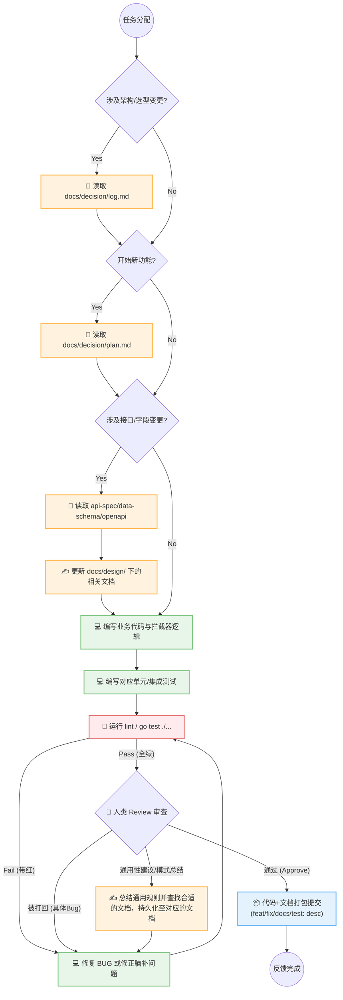

# 项目规范

> **路径**：[`docs/spec/specification.md`](specification.md)  
> **用途**：AI 辅助开发工作流、Git 提交规范、分支策略、工具和文档规范。

---

## 1. AI 辅助开发工作流（AI-Native Workflow）

本项目采用 **规格驱动开发 (Spec-Driven Development)** 作为 AI 辅助开发的核心方法论。

### 1.1 核心理念

| 概念 | 说明 |
|:---|:---|
| **规格驱动** | 文档/规格是第一公民，AI 以文档为输入生成代码，而非靠直觉"vibe coding" |
| **人类负责架构** | 开发者定义架构、需求、评审；AI 负责实现、生成样板代码 |
| **AI 是结对程序员** | AI 生成草稿，人类逐行评审，对齐架构意图和边界情况 |
| **上下文即质量** | AI 输出质量与给到的上下文质量直接挂钩 |

### 1.2 开发流程：四阶段循环



> 复杂功能拆分为多个短循环，不要一次性让 AI 实现几百行代码。

### 1.3 上下文管理

**给 AI 的上下文质量决定输出质量**，核心原则：

- **精不在多**：过多无关上下文会降低 AI 性能，找到"最小高信号"上下文集合。
- **文档即上下文**：`AGENTS.md`、`docs/` 下的设计文档是给 AI 的持久上下文，保持更新。
- **会话切分**：复杂任务按阶段（设计/实现/测试）拆分会话，避免上下文窗口污染。
- **决策留记录**：架构决策和选型原因写入文档`AGENTS.md` 或设计文档，不要只存在对话历史里。

### 1.4 `AGENTS.md` 规范

本项目根目录的 [`AGENTS.md`](../../AGENTS.md) 是给 AI 编码 Agent 的"README"，遵循以下原则：

| 原则 | 说明 |
|:---|:---|
| **极简设计** | 只写 AI 无法从代码库本身推断的内容 |
| **工具链优先** | 能用 linter/formatter/类型检查器约束的，不写进 `AGENTS.md` |
| **聚焦能力描述** | 描述项目能做什么，而非文件系统结构（结构会变，能力相对稳定）|
| **变更即记录** | 每次重要架构决策和原因都更新 `AGENTS.md` |
| **纳入版本控制** | `AGENTS.md` 随代码一起提交，可追溯历史 |

### 1.5 AI 辅助注释规范 (AI-optimized Annotation)

为了提升 Agent 的 RAG（检索增强生成）质量和上下文理解能力，本项目采用 **"AI 友好型注释"** 体系。

#### 1.5.1 核心原则：Why > What
- **代码即 What**：AI 具备极强的代码阅读能力，无需重复描述函数在做什么（如 `// Add adds two numbers` 是垃圾信息）。
- **注释即 Why**：记录代码无法表达的**意图、背景、业务规则、权衡（Trade-offs）**。

#### 1.5.2 结构化标签 (Priority Tags)
Agent 在遍历代码时应优先识别并遵循以下标签：

| 标签 | 用途 | 示例 |
|:---|:---|:---|
| `@ai-context` | 注入本项目特有的背景知识，防止 Agent 脑补通用逻辑。 | `// @ai-context: 这里的 UID 必须是 10001 起步，以区分系统内置账号。` |
| `@logic-hint` | 解释复杂的业务规则或非直观的算法逻辑。 | `// @logic-hint: 禁着点判定必须先于劫争判定，防止逻辑死循环。` |
| `@ai-fix` | 标记为了纠正 AI 曾犯过的重复性错误而特意编写的代码。 | `// @ai-fix: 强制在 context 结束后关闭 channel，防止 AI 脑补自动回收。` |
| `@decision` | 关联到特定的架构决策记录 (ADR) 或设计文档。 | `// @decision: 见 docs/decision/log.md#ADR-003，此处放弃 Redis 改用内存 map。` |
| `@stub` | 明确标记为脚手架/占位代码，提醒 Agent 填充或不要删除。 | `// @stub: 待授权模块上线后此处需接入鉴权拦截器。` |

#### 1.5.3 块注释规范 (Context Blocks)
对于高度复杂的业务函数，使用 Markdown 友好的块注释：
```go
/*
  @logic-hint: 围棋提子算法实现
  1. 递归统计落子相邻弦的“气”。
  2. 若气为 0 且非自杀，则触发提子。
  3. 提子顺序需严格遵循“对方优先”原则。
  Ref: [rule-engine.md](../../docs/design/rule-engine.md)
*/
```

---

## 2. 版本控制规范（Git）

### 2.1 提交规范

采用 **Conventional Commits** 格式：

```
<type>(<scope>): <description>

[可选 body：说明 why，不是 what]
```

| type | 含义 |
|:---|:---|
| `feat` | 新功能 |
| `fix` | Bug 修复 |
| `docs` | 文档变更 |
| `refactor` | 重构（不改功能） |
| `test` | 测试相关 |
| `chore` | 构建/工具链/配置 |

**示例**：
```
feat(ws): inject roomInbound channel on JOIN_ROOM
fix(auth): fix cookie not sent on WS upgrade due to SameSite mismatch
docs(api-spec): add auth middleware fallback strategy
```

### 2.2 原子提交原则

**Agent 主动控制粒度，边做边提交。**

"原子"指**逻辑范围**，不是文件数量——一次改动可以横跨多个文件，只要它们解决的是同一个问题或同一类共性问题，就是一个 commit。

```
✅ 一个 commit，多个文件（同一逻辑变更）：
  改 user.go + data-schema.md + api-spec.md
  → git commit "feat(user): add dnd (do-not-disturb) field"

✅ 批量共性修改，一个 commit：
  所有文件 doc 索引路径更新
  → git commit "docs: update all cross-doc links to new folder structure"

❌ 避免：
  一个 commit 混入两个无关功能的改动，从 message 看不出边界
```

完成一个逻辑变更后，先跑单元测试（§2.3），通过再 commit。不积累多个改动再统一提交。

**规则**：
- 一个 commit 封装一个逻辑变更，不打包无关修改
- 代码变更和对应文档变更合并在同一 commit
- 分支合并前 squash 掉纯调试性的临时提交

### 2.3 单元测试工作流

**触发时机：每次 commit 前，Agent 负责执行。**

```
① 实现变更
② 运行 lint（静态分析，比测试快，优先排查低级问题）
   - 后端：golangci-lint run ./...
   - 前端：npm run lint
③ 运行受影响模块的单元测试
   - 后端：go test ./internal/...
   - 前端：npm run test（待 vitest 配置后补充）
④ lint + 测试全部通过 → git commit
⑤ 任一失败 → 修复后从 ② 重跑，不允许带红的 commit
```

**规则**：
- 新功能必须同步补测试，测试和实现在同一个 commit
- 纯文档变更（无代码改动）可跳过 lint 和测试步骤，且纯文档变更不需要 agent 提交 commit，由人类确认
- 测试覆盖优先级：核心规则引擎（围棋规则判定）> Repository 层 > API 层
- 单元测试使用 mock，不依赖真实 DB / Redis

### 2.4 接口测试工作流

**触发时机：改动涉及 controller / middleware / router 层时。**

接口测试用 Go 的 `httptest` 包启动测试服务，发真实 HTTP 请求验证路由和响应格式，不需要真实 MySQL/Redis（用 mock repository 或 in-memory stub）。

```
需要跑接口测试的场景：
- 新增或修改 REST 接口（路径、method、参数、响应结构）
- 修改鉴权 Middleware（Header/Cookie fallback 逻辑）
- 修改路由注册（router.go）
- 修改统一响应格式（response 封装层）

不需要的场景：
- 只改 biz 层 / repository 层（单元测试覆盖即可）
- 只改文档 / 配置
```

```go
// 接口测试示例：验证路由分发与统一响应格式
func TestEndpointHandler(t *testing.T) {
    r := setupTestRouter()  // 注入 mock 业务层
    w := httptest.NewRecorder()
    req := httptest.NewRequest("POST", "/api/v1/resource/action", body)
    r.ServeHTTP(w, req)
    
    assert.Equal(t, http.StatusOK, w.Code)
    // 验证全局 response 封装是否一致
    var resp response.Response
    json.Unmarshal(w.Body.Bytes(), &resp)
    assert.Equal(t, e.Success, resp.Code)
}
```

### 2.5 集成测试工作流

**触发时机：合并到 `main` 之前（发版前），不在每次 commit 跑。**

集成测试启动真实 MySQL + Redis（本地 Docker Compose），跑端到端验收用例，验证各层协作正确。

```
触发条件：
  - feat/* 或 fix/* 分支准备 PR 到 main 时
  - 重大重构（Repository 层、WS Hub 架构改动）后

运行方式：
  docker compose up -d mysql redis
  go test ./test/integration/... -tags=integration
  docker compose down

覆盖用例（优先级排序）：
  P0 注册 → 登录 → 创建房间 → WS 握手 → 断线重连
  P1 落子合法性 + 提子 + 劫争（规则引擎端到端）
  P1 Token 过期 → refresh → 重新鉴权
  P2 并发落子冲突（两人同时发送 MOVE）
```

**为什么不在每次 commit 跑**：集成测试依赖真实基础设施、耗时长（秒级），在每次提交跑会显著拖慢开发节奏。单元测试 + 接口测试已足够覆盖日常变更的正确性。

### 2.6 分支与代码合并规范 (Branch & PR)

```
main        ← 始终可用，受保护分支。只接受从 dev（或 hotfix）合并，合并前须进行全量 E2E/集成测试验证。
dev         ← 日常集成与测试分支。
feat/<name> ← 功能分支，从 dev 切出，开发完成后创建 PR 合并回 dev。
fix/<name>  ← Bug 修复分支。
```

**Pull Request (PR) 最佳实践**：
- **自我审查 (Self-Review)**：提交 PR 前，开发者（含 AI）需运用 `diff` 对完整变更自行审查。
- **PR 描述结构**：必须包含改动背景（Why）、核心改动点（What）及本地测试通过的证明（How verified）。
- **合并策略**：推荐使用 `Squash and Merge` 保持目标分支记录的线性与整洁，合并时再次确保 Commit Message 符合规范。

### 2.7 依赖管理与发布 (Dependencies & Release)

- **依赖管控**：严禁随意引入第三方库。新增依赖前必须核查其开源协议（倾向 MIT/Apache，规避传染性协议如 AGPL）、维护活跃度及已知安全漏洞。
- **版本规范 (SemVer)**：严格遵循 [语义化版本 2.0.0](https://semver.org/lang/zh-CN/) 规范（`MAJOR.MINOR.PATCH`），Release 时在 `main` 阶段打对应 Git Tag 触发生产发布。

---

## 3. 工具规范

### 3.1 开发工具链

| 工具 | 用途 |
|:---|:---|
| Git | 版本控制，所有变更必须提交 |
| Antigravity (当前 AI Agent) | 主要编码 Agent，负责实现、重构、文档 |
| Cursor / VS Code | IDE |

### 3.2 AI 工具使用原则

- **评审每次变更**：AI 生成的代码须逐段评审，不盲目接受大批量变更。
- **任务粒度控制**：单次 AI 任务聚焦在一个小功能或一个文件，避免范围蔓延。
- **新增规则的时机**：只在 AI 反复犯同一个错误时才新增约束规则，不预优化。
- **不重复工具链**：linter 能检查的不口头重申，类型系统能约束的不写样板注释。

---

## 4. 文档规范

### 4.1 文档结构

参见 [`AGENTS.md`](../../AGENTS.md)

### 4.2 文档维护原则

- **文档先于代码**：功能实现前先更新对应设计文档。
- **决策留痕**：有争议的设计选择记录备选方案和最终选择原因（参考 `learn/why.md` 的格式）。
- **与代码同步**：代码重构后同步更新相关文档，防止文档腐烂。

---

## 5. 代码规范

各语言的详细规范见独立文件：

| 文件 | 内容 |
|:---|:---|
| [code-style-go.md](./code-style-go.md) | 格式化、命名、错误处理、并发、注释规范 |
| [code-style-ts.md](./code-style-ts.md) | 格式化、命名、类型系统、组件、Hook 规范 |

**跨语言通用原则**：
- 命名自解释，注释说明 **why**，不是 what。
- 错误处理显式，不吞错误（Go: 不忽略 `err`；TS: 不吞 `catch`）。
- 函数职责单一：Go 超过 **50 行**、TS 组件超过 **150 行**考虑拆分。
- 格式化交给工具（`gofmt` / Prettier），不在 Review 里讨论风格。
